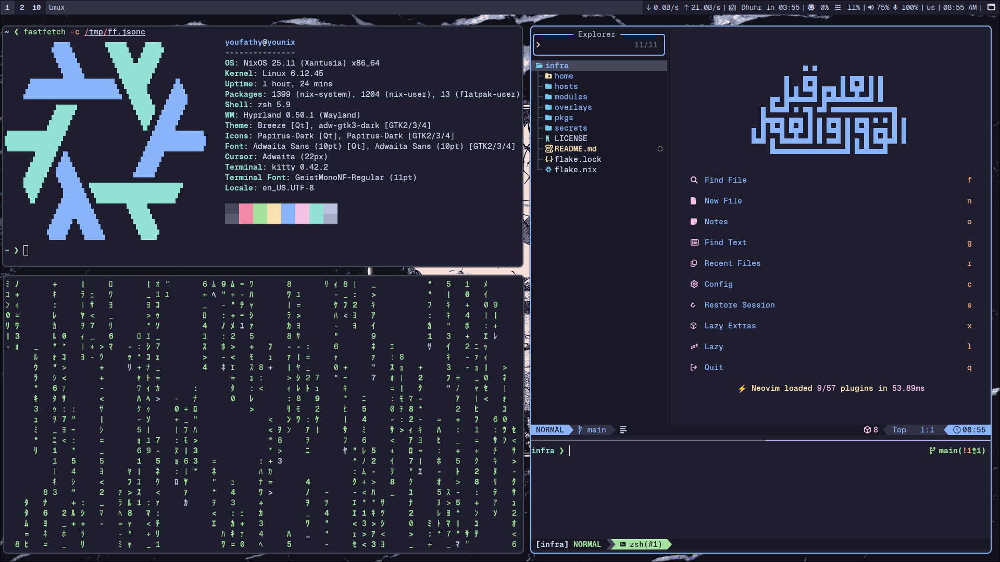

# NixOS & Home Manager Configuration

A modular and declarative configuration for **NixOS** and **Home Manager**, powered by flakes and [sops-nix](https://github.com/Mic92/sops-nix) for secrets management.

## 📸 Screenshots



## 🚀 Fresh Installation

Follow these steps to set up a brand-new machine with this configuration:

### 1. Generate a new age key for the host

```bash
nix shell nixpkgs#age --command age-keygen -o keys.txt
```

### 2. Register the host key

Add the **public key** to `.sops.yaml` and use for encrypting the following secrets:

- `secrets/hosts/common.yml`
- `secrets/hosts/<new-host>.yml`

### 3. Use the master key to re-encrypt secrets using the new host key

```bash
export SOPS_AGE_KEY_FILE=/path/to/master/keys.txt
sops updatekeys secrets/hosts/*
sops updatekeys secrets/users/*
```

### 4. Place the generated private key on the new system

Copy the generated `keys.txt` file to the remote host:

```bash
scp keys.txt root@<new-host>:/var/lib/sops-nix/keys.txt
```

### 5. Install NixOS

- Install the system using your `flake.nix`.
- Ignore `sops-nix.service` errors during first boot — this is expected since user keys are not yet available.

```bash
sudo nixos-install --flake .#<new-host>
```

### 6. Boot into the system

Reboot into the freshly installed NixOS.

### 7. Add user keys

For each user, move their private key to:

```
/home/<username>/.config/sops/age/keys.txt
```

### 8. Rebuild the system

```bash
sudo nixos-rebuild switch --flake .#<new-host>
```

Now everything should work, including host and user secrets decryption.
